#  Olá, eu sou Kawã Correia

<div align="center">


[](https://seu-portfolio.com)
[](https://linkedin.com/in/seu-perfil)
[](mailto:kawaklebersc@gmail.com)


</div>

## Sobre Mim

```bash
┌─[kawã@redteam]─[~/developer_profile]
└──╼ $ ./scan_developer.sh

    ██╗  ██╗ █████╗ ██╗    ██╗ ██████╗
    ██║ ██╔╝██╔══██╗██║    ██║██╔════╝
    █████╔╝ ███████║██║ █╗ ██║██║  ███╗
    ██╔═██╗ ██╔══██║██║███╗██║██║   ██║
    ██║  ██╗██║  ██║╚███╔███╔╝╚██████╔╝
    ╚═╝  ╚═╝╚═╝  ╚═╝ ╚══╝╚══╝  ╚═════╝
    
    Full Stack Developer | Brazilian Cyber Warrior

┌─[kawã@redteam]─[~/developer_profile]
└──╼ $ nmap -A -T4 kawã_correia.local

Starting Nmap 7.94 ( https://nmap.org )
Nmap scan report for kawã_correia.local (192.168.1.337)
Host is up (0.00ms latency).

PORT      STATE SERVICE     VERSION
22/tcp    open  ssh         Brazilian-Developer 3.0
| ssh-hostkey:
|   3072 pronouns: ele/dele
|   256  location: Brasil 🇧🇷  
|   256  role: Full Stack Developer
80/tcp    open  http        Frontend-Master 3.0+
|_http-title: React Specialist | 3+ Years Experience
443/tcp   open  https       Secure-Solutions
8000/tcp  open  http-alt    Backend-Ninja 1.0+
|_http-title: Node.js Expert | API Master
27017/tcp open  mongodb     Database-Wizard
|_mongodb-info: MongoDB specialist

Service detection performed. All services are AWESOME! 🚀

┌─[kawã@redteam]─[~/developer_profile]
└──╼ $ cat exploit_passion.py
#!/usr/bin/env python3

class KawãDeveloper:
    def __init__(self):
        self.name = "Kawã Correia"
        self.location = "Brasil 🇧🇷"
        self.role = "Full Stack Developer"
        self.experience = {
            "frontend": "3+ anos - EXPERT",
            "backend": "1+ ano - ADVANCED", 
            "mobile": "Em desenvolvimento - LOADING..."
        }
        
    def exploit_problems(self, real_world_problem):
        """Transform any problem into digital solution"""
        solution = self.apply_creativity(real_world_problem)
        return f"Problem SOLVED: {solution} 💡"
        
    def get_vulnerability_scan(self):
        return {
            "weakness": "Impossível parar de aprender 📚",
            "exploit": "Sempre buscando novos desafios 🎯",
            "backdoor": "kawaklebersc@gmail.com 📧"
        }

┌─[kawã@redteam]─[~/developer_profile]  
└──╼ $ python3 exploit_passion.py
[+] Target acquired: Real world problems
[+] Payload: Creative digital solutions  
[+] Exploitation successful: Problem transformed! ✅
[+] Persistence: Always learning and growing 🔄
[+] Command & Control: kawaklebersc@gmail.com 📡
```

## Tech Stack

### Frontend
<div align="center">


</div>

### Backend
<div align="center">


</div>

### Database
<div align="center">


</div>

### Mobile
<div align="center">


</div>

### Ferramentas & Outras Tecnologias
<div align="center">


</div>

## Estatísticas GitHub

<div align="center">
  
[](https://github.com/Izileth)

[](https://github.com/Izileth)

</div>

## Conquistas & Experiências

<div align="center">

|  **Área** |  **Experiência** |  **Principais Tecnologias** |
|-------------|--------------------|---------------------------------|
| **Frontend** | 3+ anos | React JS, JavaScript, CSS3, HTML5 |
| **Backend** | 1+ ano | Node.js, Express, API REST |
| **Database** | 2+ anos | MongoDB, MySQL, PostgreSQL |
| **Mobile** | Em desenvolvimento | React Native, Expo |

</div>

##  Projetos em Destaque

<div align="center">

[](https://github.com/Izileth/Prestige-Motors-Ecommerce)
[](https://github.com/Izileth/Ecliptica-Ecommerce)

</div>

##  Atividade GitHub

<div align="center">

[](https://github.com/Izileth)

</div>

##  Filosofia de Desenvolvimento

> *"Sempre em busca de novos desafios e habilidades para criar soluções inovadoras que resolvam problemas da vida real."*

```mermaid
graph TD
    A[ Problema Real] --> B[ Análise]
    B --> C[ Solução Criativa]
    C --> D[ Desenvolvimento]
    D --> E[ Solução Entregue]
    E --> F[ Aprendizado Contínuo]
    F --> A
```

<div align="center">



</div>

## Atualmente Aprendendo

- **Desenvolvimento Mobile** com React Native
-  **DevOps** e CI/CD
-  **Cloud Computing** (AWS/Azure)
-  **UI/UX Design** principles
-  **Data Science** fundamentals

##  Vamos Conectar!

<div align="center">

 **Estou sempre aberto para novos projetos e colaborações!**

[](mailto:kawaklebersc@gmail.com)

** Se você gostou do meu perfil, deixe uma estrela nos repositórios!**

</div>

---

<div align="center">

**💖 Obrigado pela visita!**


</div>
