#  Olá, eu sou Kawã Correia

<div align="center">


[](https://seu-portfolio.com)
[](https://linkedin.com/in/seu-perfil)
[](mailto:kawaklebersc@gmail.com)

</div>

## Sobre Mim

```javascript
const kawã = {
    pronouns: "ele/dele",
    location: "Brasil 🇧🇷",
    role: "Full Stack Developer",
    experience: {
        frontend: "3+ anos",
        backend: "1+ ano",
        mobile: "Em desenvolvimento"
    },
    passion: "Transformar problemas reais em soluções digitais",
    currentFocus: "Desenvolvimento mobile e novas tecnologias",
    lifePhilosophy: "Sempre em busca de novos desafios e aprendizado"
};
```

## Tech Stack

### Frontend
<div align="center">


</div>

### Backend
<div align="center">


</div>

### Database
<div align="center">


</div>

### Mobile
<div align="center">


</div>

### Ferramentas & Outras Tecnologias
<div align="center">


</div>

## Estatísticas GitHub

<div align="center">
  
[](https://github.com/SEU_USUARIO)

[](https://github.com/SEU_USUARIO)

</div>

## Conquistas & Experiências

<div align="center">

|  **Área** |  **Experiência** |  **Principais Tecnologias** |
|-------------|--------------------|---------------------------------|
| **Frontend** | 3+ anos | React JS, JavaScript, CSS3, HTML5 |
| **Backend** | 1+ ano | Node.js, Express, API REST |
| **Database** | 2+ anos | MongoDB, MySQL, PostgreSQL |
| **Mobile** | Em desenvolvimento | React Native, Expo |

</div>

##  Projetos em Destaque

<div align="center">

[](https://github.com/Izileth/Prestige-Motors-Ecommerce)
[](https://github.com/Izileth/Ecliptica-Ecommerce)

</div>

##  Atividade GitHub

<div align="center">

[](https://github.com/Izileth)

</div>

##  Filosofia de Desenvolvimento

> *"Sempre em busca de novos desafios e habilidades para criar soluções inovadoras que resolvam problemas da vida real."*

```mermaid
graph TD
    A[ Problema Real] --> B[ Análise]
    B --> C[ Solução Criativa]
    C --> D[ Desenvolvimento]
    D --> E[ Solução Entregue]
    E --> F[ Aprendizado Contínuo]
    F --> A
```

<div align="center">



</div>

## Atualmente Aprendendo

- **Desenvolvimento Mobile** com React Native
-  **DevOps** e CI/CD
-  **Cloud Computing** (AWS/Azure)
-  **UI/UX Design** principles
-  **Data Science** fundamentals

##  Vamos Conectar!

<div align="center">

 **Estou sempre aberto para novos projetos e colaborações!**

[](mailto:kawaklebersc@gmail.com)

** Se você gostou do meu perfil, deixe uma estrela nos repositórios!**

</div>

---

<div align="center">

**💖 Obrigado pela visita!**


</div>
